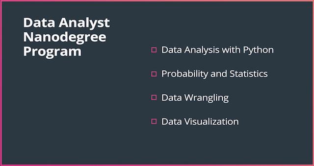
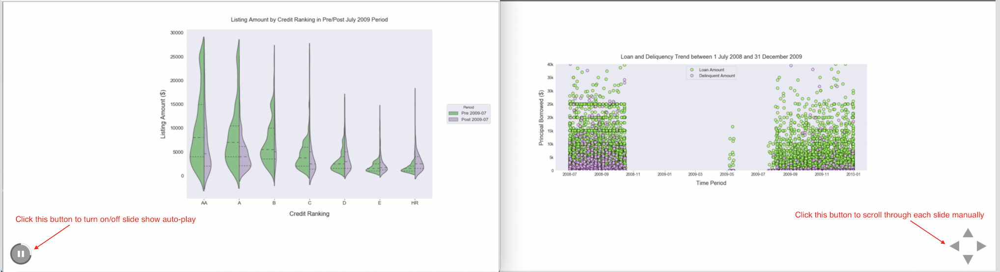

# Data Analyst Nanodegree (DAND), Udacity
This repo contains a collection of project deliverables from my DAND course work.
 ---

## Project Deliverables Summary
### 1. [Explore Weather Trends](https://github.com/atan4583/dand-project-portfolio/tree/master/Project%201-Explore%20Weather%20Trends)
> * Analyzed local and global temperature data and compared the temperature trends in my home city to overall global temperature trends.
>
>
> * Produced a visualization and prepared a report describing the similarities and differences between global temperature trends and temperature trends of my home city.
>
>
> * Tool used: Excel, Jupyter Notebook (Python)
>
>
> * Programming libraries used: pandas, matplotlib
>
>
> * Artifacts: Project 1-Explore Weather Trends.xlsx, Project 1-Explore Weather Trends (Global vs Multi-City).ipynb
>
>
> ### [Project Assessment](https://github.com/atan4583/dand-project-portfolio/blob/master/Project%201-Explore%20Weather%20Trends/Project1%20Review.pdf)
 ---
### 2. [Investigate a Dataset](https://github.com/atan4583/dand-project-portfolio/tree/master/Project%202-Investigate%20a%20Dataset)
> * Analyzed a [kaggle dataset](https://www.kaggle.com/joniarroba/noshowappointments) containing 100k medical appointments in Brazil, to examine the data characteristics and deduce what are the major factors behind the no show of patients
>
>
> * Documented the analysis process along with visualizations to explain the findings and support the conclusions drawn.
>
>
> * Tool used: Jupyter Notebook (Python)
>
>
> * Programming libraries used: pandas, numpy, matplotlib, seaborn
>
>
> * Artifact: Project 2-Investigate a Dataset.ipynb
>
>
> ### [Project Assessment](https://github.com/atan4583/dand-project-portfolio/blob/master/Project%202-Investigate%20a%20Dataset/Project2%20Review.pdf)
 ---
### 3. [Analyze A/B Test Results](https://github.com/atan4583/dand-project-portfolio/tree/master/Project%203-Analyze%20AB%20Test%20Results)
> * Use the knowledge gained from the lessons in Practical Statistics, analyzed the results of an A/B test run by an e-commerce website to determine if the company should implement the new page, keep the old page, or perhaps run the experiment longer to make their decision.
>
>
> * Analysis was conducted using 3 approaches - probabilistic reasoning, hypothesis testing and logistic regression to cross examine the results produced and draw conclusions.
>
>
> * Tool used: Jupter Notebook (Python)
>
>
> * Programming libraries used: panda, numpy, matplotlib, statsmodels
>
>
> * Artifact: Analyze_ab_test_results_notebook.ipynb
>
>
> ### [Project Assessment](https://github.com/atan4583/dand-project-portfolio/blob/master/Project%203-Analyze%20AB%20Test%20Results/Project3%20Review.pdf)
 ---
### 4. [Project 4-Wrangle and Analyze Data](https://github.com/atan4583/dand-project-portfolio/tree/master/Project%204-Wrangle%20and%20Analyze%20Data)
> * Apply the concepts learned from the lessons in Data Wrangling, to gather data from a variety of sources and in a variety of formats, assess its quality and tidiness, then clean it. Showcase data wrangling efforts through analyses and visualizations.
>
>
> * Gather data from 3 sources:
>   - WeRateDogs Twitter archive. This contains 5000+ basic tweet data about dog rating, name, and "stage"
>   - tweet image predictions from [Udacity site](https://d17h27t6h515a5.cloudfront.net/topher/2017/August/599fd2ad_image-predictions/image-predictions.tsv). This file contains dog breed prediction results (from a Neural Network classifier) for every dog images from the WeRateDogs Twitter archive.
>   - Twitter API tweepy. Use this API to query additional data (in JSON format) for each tweet ID in the WeRateDogs Twitter archive.
>
>
> * After gathering the data, assess them visually and programmatically for quality and tidiness issues. Detect and document at least eight (8) quality issues and two (2) tidiness issues
>
>
> * Clean each of the issues identified, document the cleaning steps taken and output the results to a high quality and tidy master pandas DataFrame.
>
>
> * Analyze and visualize the wrangled data to produce at least three (3) insights and one (1) visualization
>
>
> * Produce a 300-600 word written report with brief description of the wrangling efforts, frame it as an internal document. Create another 250-word-minimum written report to communicate the insights and displays the visualization(s) produced from the wrangled data. Frame it as an external document, like a blog post or magazine article
>
>
> * Tool used: Jupter Notebook (Python)
>
>
> * Programming libraries used: panda, numpy, matplotlib, seaborn, tweepy, json, requests
>
>
> * Artifact:
>   - wrangle_act.ipynb
>   - wrangle_report.pdf, wrangle_report.html
>   - act_report.pdf, act_report.html
>   - twitter_archive_enhanced.csv, image_predictions.tsv, tweet_json.txt, twitter_archive_master.csv, twitter_archive.db
>
>
> ### [Project Assessment](https://github.com/atan4583/dand-project-portfolio/blob/master/Project%204-Wrangle%20and%20Analyze%20Data/Project4%20Review.pdf)
 ---
### 5. [Project 5-Data Visualization](https://github.com/atan4583/dand-project-portfolio/tree/master/Project%205-Data%20Visualization)
> * Utilize concepts taught in the lessons in Data Visualization, first perform wrangling operation on a selected dataset to extract a subset of observations and features, followed by exploration to discover interesting properties, trends, and relationships in the subset. Document the findings in univariate, bivariate and multivariate visualizations.
>
>
> * Produce a short presentation to convey findings by transforming the exploratory visualizations from the exploration part into polished, explanatory visualizations.
>
>
> * Tool used: Jupter Notebook (Python)
>
>
> * Programming libraries used: panda, numpy, matplotlib, seaborn
>
>
> * Artifact:
>   - Communicate_Data_Findings-Prosper_Loan_Part1.ipynb, Communicate_Data_Findings-Prosper_Loan_Part1.html
>   - Communicate_Data_Findings-Prosper_Loan_Part2.ipynb, Communicate_Data_Findings-Prosper_Loan_Part2.html
>   - Communicate_Data_Findings-Prosper_Loan_Part2.slides.html (_**slide show**_)
>   - readme.md
>   - prosperLoanData_src.csv (for data wrangling use), prosperLoanData.csv (for exploration and explanatory use)
>
>
> ### [Project Assessment](https://github.com/atan4583/dand-project-portfolio/blob/master/Project%205-Data%20Visualization/Project5%20Review.pdf)
>
>
> To see the _**slide show**_, download it from [here](https://drive.google.com/file/d/1HAbhPb7Lt-Vz05rvCqycRuFS9agLe_Y8/view?usp=sharing) and open it in a browser. To suspend slide show auto-play, click the _**Auto Play**_ button at the bottom left end of the page. To manually advance the slide, click the _**Manual Play**_ button at the bottom right end of the page, as shown below.
> 
>
